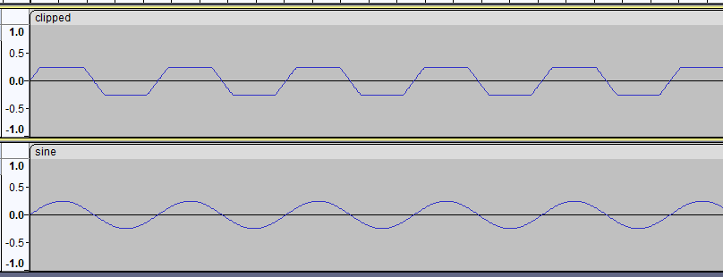

<!--
A Markdown file README.md with your name near the top. 
Briefly describe what you did, how it went, and what is still to be done.
-->

# Homework 1

Christopher Juncker

## Part 1

For Part 1 of this assignment, I created a very simple class to hold the specification
information provided in the assignment. Then I built a second class from this which used
this specification information to generate an array of samples. Then I used the 
`wavefile` functionality included in the `scipy` library to write my array to a file
named `sine.wav`.

## Part 2

For Part 2, I implemented a few additional lines of code which clipped the samples in
the array. Then I simply called my function from Part 1 to write the new samples to
another audio file `clipped.wav` as instructed.

## Part 3

For Part 3, I used the `pyaudio` library to play both of the files which are generated
by my program on my computer's speakers. I had a little trouble getting `pyaudio`
installed on my computer, but once that was out of the way everything was pretty
straight-forward.

## Conclusion

I believe that I have successfully completed all the required portions of this assignment.
Below is an image from Audacity of the waveforms of both of my audio files:

